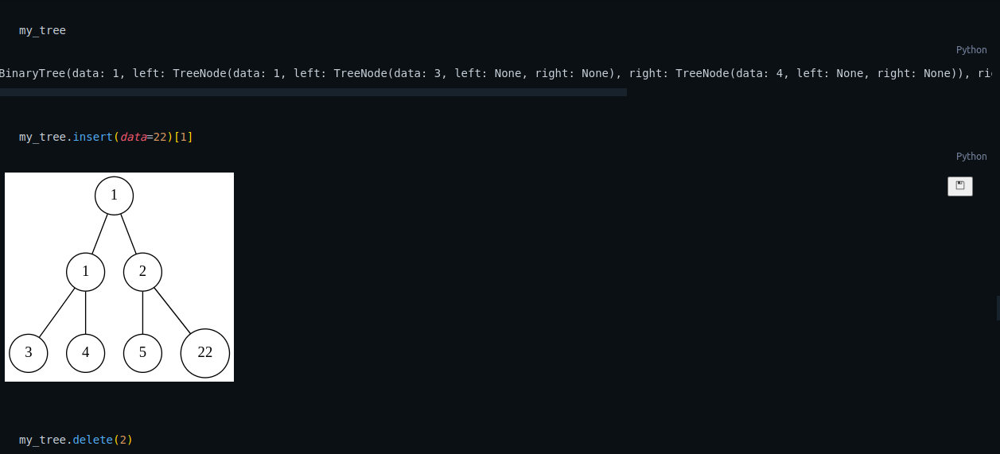

# Binary Tree Visualiser
- Like [linked list visualizer](https://github.com/anurag-desp/linked-list-visualisation), this code is a visualization tool for basic operations in a binary tree.
- [graphviz](https://graphviz.org/) is super cool and fun! DOT is quite interesting.
- Got to learn a lot.
- The code may be a little messy and buggy. Its the first version.

## Sample

- Looking forward to suggestions and pull requests!